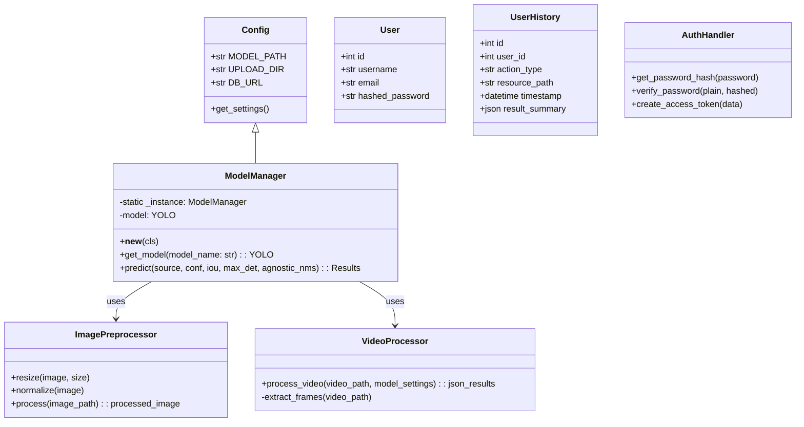

# Design Document - Oloy11

## 1. Class Diagram



## 2. Pseudocode

### Singleton Model Loader
```python
class ModelManager:
    _instance = None
    _model = None

    @classmethod
    def get_instance(cls):
        if cls._instance is None:
            cls._instance = cls()
        return cls._instance

    def load_model(self, model_name="yolo11n.pt"):
        if self._model is None:
            self._model = YOLO(model_name)
        return self._model
    
    def run_inference(self, source, **kwargs):
        model = self.load_model()
        return model(source, **kwargs)
```

### API Endpoints Logic

#### Image Inference
```python
def predict_image(file, settings):
    # 1. Save uploaded file/Validate URL
    # 2. Preprocess image (ImagePreprocessor)
    # 3. Get Model (ModelManager)
    # 4. Run Inference
    # 5. Process Results (to_json)
    # 6. Save User History
    return results_json
```

#### Video Inference
```python
def predict_video(file, settings):
    # 1. Save video file 
    # 2. Open Video Capture
    # 3. Loop frames
        # Run Inference per frame
        # Accumulate results
    # 4. Save processed video (optional) or return metadata
    # 5. Save User History
    return analysis_summary
```

#### Auth
```python
def login(username, password):
    user = db.get_user(username)
    if verify_password(password, user.password):
        return token
    raise Unauthorized
```
